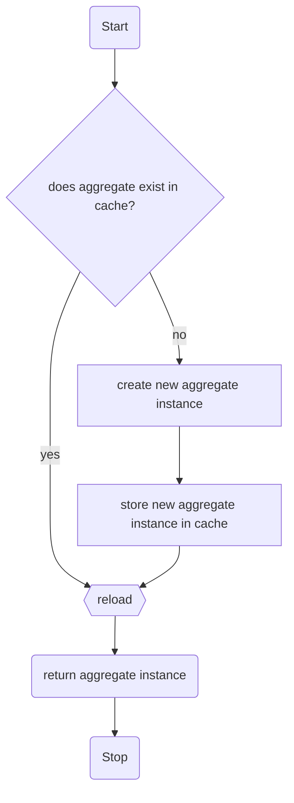

```mermaid
flowchart TB
  A(Start) --> B{does aggregate exist in cache?}
  B --> |yes| C{{reload}}
  B --> |no| D[create new aggregate instance]
  D --> E[store new aggregate instance in cache]
  E --> C
  C --> F(return aggregate instance)
  F --> G(Stop)
```
