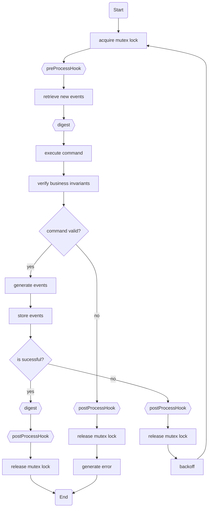

```mermaid
flowchart TB
  A(Start) --> B[acquire mutex lock]
  B --> Q{{preProcessHook}}
  Q --> P[retrieve new events]
  P --> C{{digest}}
  C --> D[execute command]
  D --> E[verify business invariants]
  E --> F{command valid?}
  F --> |yes| G[generate events]
  F --> |no| M{{postProcessHook}}
  M --> S[release mutex lock]
  S --> N[generate error]
  G --> H[store events]
  H --> I{is sucessful?}
  I --> |no| T{{postProcessHook}}
  I --> |yes| J{{digest}}
  J --> R{{postProcessHook}}
  R --> O[release mutex lock]
  T --> K[release mutex lock]
  K --> L[backoff]
  L --> B
  O --> Z
  N --> Z(End)
```
