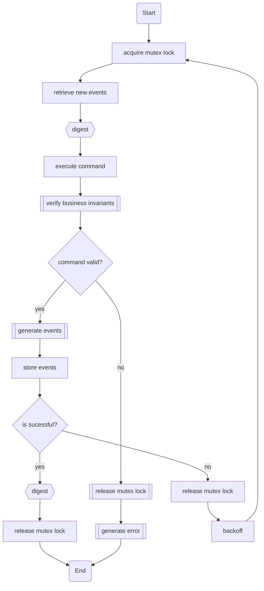

```mermaid
flowchart TB
  A(Start) --> B[acquire mutex lock]
  B --> P[retrieve new events]
  P --> C{{digest}}
  C --> D[execute command]
  D --> E[[verify business invariants]]
  E --> F{command valid?}
  F --> |yes| G[[generate events]]
  F --> |no| M[[release mutex lock]]
  M --> N[[generate error]]
  G --> H[store events]
  H --> I{is sucessful?}
  I --> |yes| J{{digest}}
  J --> O[release mutex lock]
  I --> |no| K[release mutex lock]
  K --> L[backoff]
  L --> B
  O --> Z
  N --> Z(End)
```
